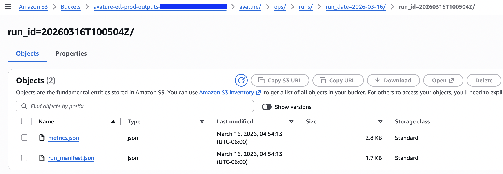
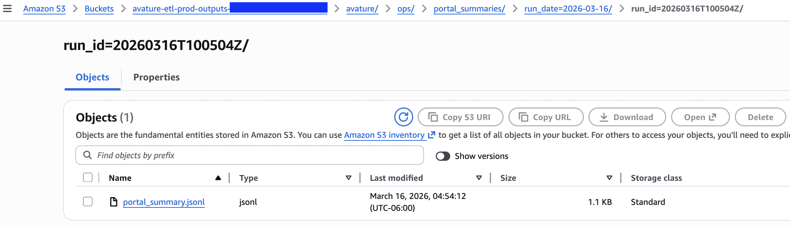
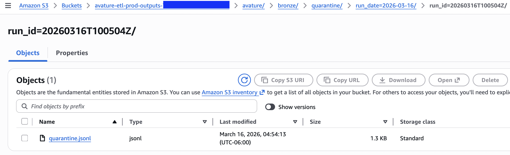
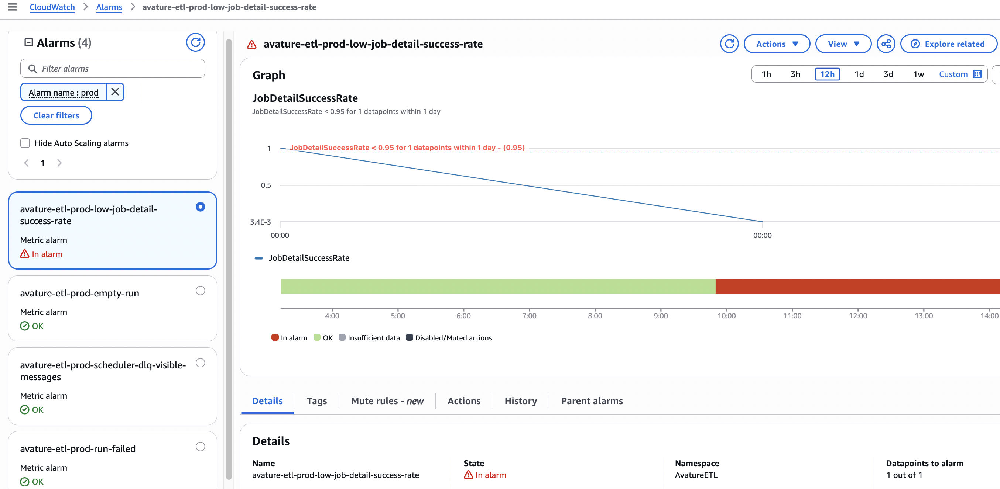

# Avature ATS ETL Pipeline

<p align="center"><a href="https://github.com/ahmedshahriar/avature-ats-etl-pipeline/actions/workflows/ci.yml"></a> <a href="https://github.com/ahmedshahriar/avature-ats-etl-pipeline/actions/workflows/cd.yml"></a> <a href="https://docs.astral.sh/ruff/"></a> <a href="LICENSE"></a></p>

<p align="center"> <a href="https://scrapy.org/"></a> <a href="https://aws.amazon.com/cdk/"></a></p>

A Scrapy-based end-to-end ETL pipeline for crawling Avature career portals (job listings → job details) and exporting job listings.

Engineered for reliable cloud execution, this project features:

- **Infrastructure as Code (IaC)** provisioning managed entirely via AWS CDK
- **Scheduled serverless execution** using EventBridge to trigger ECS Fargate tasks
- **Scalable data lake storage** writing scraped payloads and metrics summaries directly to S3
- **Cross-run idempotency & deduplication** powered by DynamoDB
- **Data quality controls** with validation, warnings, and quarantine for invalid records
- **Operational observability** with CloudWatch logging, EMF metrics and alarms, SNS alerts for failed tasks/runs
- **Fault tolerance** using SQS Dead Letter Queue (DLQ) for failed invocations
- **Automated CI/CD** using GitHub Actions with secure AWS OIDC integration

---

## What it extracts

From each Avature job detail page, the spider extracts the core job record plus lineage and validation metadata.

### Core fields

- **Job Title (`title`)**
- **Job Description (`description_text`)** (clean text; derived from Avature sections)
- **Application URL (`apply_url`)**

### Metadata when available

- `locations`
- `posted_date`
- `company`
- `career_area`
- `employment_type`
- `remote`
- `ref_number`
- `job_id`


### Lineage and identity fields

- `source_url` — canonical detail URL used as the stable item URL
- `canonical_source_url` — normalized detail URL used for stable identity
- `raw_source_url` — raw URL returned by the site before canonicalization
- `portal_key` — stable portal identifier such as `ally.avature.net/careers`
- `input_seed_url` — the listing URL from `seed_urls.csv` that led to the crawl
- `run_id` — unique execution identifier
- `scraped_at` — UTC timestamp when the item was produced
- `job_hash` — stable unique job key derived from portal identity and job identity

### Validation fields

- `validation_errors`
- `validation_warnings`
- `record_status` — `valid` or `quarantined`

### Raw extraction fallback

- `raw_fields` — raw label/value pairs captured from the page for audit/debugging

---

## Outputs

### Local

Each run creates a unique output directory:

```text
output/run_<RUN_ID>/
  jobs.jsonl
  metrics.json
  run_manifest.json
  portal_summary.jsonl
  quarantine.jsonl
  scrapy.log
```

### AWS

When deployed on AWS, outputs are written to S3:

```text
s3://<S3_BUCKET_NAME>/avature/bronze/jobs/run_date=<YYYY-MM-DD>/run_id=<RUN_ID>/jobs.jsonl
s3://<S3_BUCKET_NAME>/avature/bronze/quarantine/run_date=<YYYY-MM-DD>/run_id=<RUN_ID>/quarantine.jsonl
s3://<S3_BUCKET_NAME>/avature/ops/runs/run_date=<YYYY-MM-DD>/run_id=<RUN_ID>/metrics.json
s3://<S3_BUCKET_NAME>/avature/ops/runs/run_date=<YYYY-MM-DD>/run_id=<RUN_ID>/run_manifest.json
s3://<S3_BUCKET_NAME>/avature/ops/portal_summaries/run_date=<YYYY-MM-DD>/run_id=<RUN_ID>/portal_summary.jsonl
```

### Artifact roles

- `jobs.jsonl` — exported valid job records
- `metrics.json` — full Scrapy stats snapshot plus custom crawl/pipeline metrics
- `run_manifest.json` — run lineage summary, counts, timestamps, input fingerprint, and artifact URIs
- `portal_summary.jsonl` — portal-level crawl breakdowns and completeness metrics
- `quarantine.jsonl` — invalid records that failed hard validation checks

---

## Metrics

### Primary coverage metric

- **Coverage** = number of exported unique jobs, measured by stable `job_hash`

### Crawl funnel metrics

- `crawl/jobs_discovered_total`
- `crawl/job_detail_requests_total`
- `item_scraped_count` / `pipeline/jobs_exported_total`
- `pipeline/jobs_quarantined_total`
- `pipeline/duplicates_dropped_total`
- `pipeline/dynamodb_duplicates_dropped`

### Quality and observability metrics

- `crawl/job_detail_success_rate`
- `crawl/job_detail_parse_exception_total`
- `crawl/job_detail_parse_failure_total` (funnel-loss approximation)
- per-field completeness percentages from the pipeline
- request/response counts by request kind (`listing`, `pagination`, `job_detail`)
- response buckets by request kind (`2xx`, `3xx`, `4xx`, `5xx`)

### Artifact notes

- `metrics.json` is the full run-level stats snapshot
- `portal_summary.jsonl` contains high-cardinality portal-level breakdowns for downstream analysis
- CloudWatch EMF intentionally stays **low-cardinality** to control cost

---

## Validation and quarantine flow

Each item passes through a validation stage before it is accepted as a final exported record.

### Validation behavior

- required fields such as `title`, `description_text`, and stable identity fields are checked
- fields such as `posted_date`, `remote`, and `locations` are normalized
- missing non-critical fields produce `validation_warnings`
- missing critical fields produce `validation_errors`

### Outcome rules

- records with only warnings remain `record_status = "valid"` and are exported to `jobs.jsonl`
- records with hard validation failures are marked `record_status = "quarantined"`, written to `quarantine.jsonl`, and dropped from the final exported dataset

This gives the pipeline a clean separation between:
- **valid exported records**
- **invalid quarantined records**


## Architecture


Scraper-side ownership is intentionally split as follows:

- **Spider** — extraction, canonical URL handling, `portal_key`, and request classification
- **ValidationPipeline** — normalization, warnings/errors, and quarantine
- **JobPipeline** — exported-item metrics, EMF emission, and `run_manifest.json`
- **CrawlMetricsExtension** — crawl telemetry, `metrics.json`, and `portal_summary.jsonl`

---

## Project structure

```text
.
├── scrapy.cfg
├── seed_urls.csv          # REQUIRED: List of Avature portal URLs to scrape
├── requirements.txt
├── pyproject.toml          # Project config, dependencies (uv), and QA (ruff, ty, pre-commit)
├── Dockerfile
├── core/                   # Scrapy spider and pipeline logic
│   ├── items.py
│   ├── settings.py
│   ├── pipelines.py
│   ├── extensions.py
│   └── spiders/
│       └── avature_spider.py
├── infra/                  # AWS CDK Infrastructure as Code
│   ├── environments/
│   │   ├── dev.yaml
│   │   └── prod.yaml
│   ├── stacks/             # CDK stacks for modular infrastructure components
│   ├── tests/              # Unit tests for CDK constructs
│   ├── app.py              # Main CDK app entry point
│   └── bootstrap_app.py    # CDK app for GitHub OIDC bootstrap stack
└── output/
    └── run_<RUN_ID>/...    # job exports, metrics, and logs for each run

```

---

## Local development

### Prerequisites

* Python **3.13+**
* [`uv`](https://docs.astral.sh/uv/) recommended

### 1. Create and activate a virtual environment

```bash
uv venv
source .venv/bin/activate
```

### 2. Install dependencies

For local development, use `uv` and the project metadata in `pyproject.toml`:

```bash
uv sync
```

This installs the project’s local development dependencies.

If you prefer a plain virtual environment for the scraper runtime only:

```bash
python -m venv .venv
source .venv/bin/activate
pip install -r requirements.txt
```

### 3. Configure target URLs

The spider reads listing page URLs from a root-level `seed_urls.csv` (a sample file is included in the repository).

Add the target Avature career portal listing URLs (one per line) to `seed_urls.csv`. The spider derives its allowed domains from the URLs in this file.

Example (One URL per line):

```csv
https://example.avature.net/careers/SearchJobs
https://another-company.avature.net/en_US/careers/SearchJobs
```


### 4. Create environment configuration:

Copy the environment example file:

```bash
cp .env.example .env
```

Start with something like:

```env
PROJECT_NAME=avature-etl
ENV_NAME=dev
DEPLOY_ENV=local

LOG_LEVEL=INFO
LOGSTATS_INTERVAL=30
LOG_FILE=scrapy.log

METRICS_FILE=metrics.json
METRICS_DUMP_INTERVAL=30

SCRAPY_FEED_NAME=jobs.jsonl
SCRAPY_FEED_OVERWRITE=1
```

See `.env.example` for the full list of supported runtime settings.

### 5. Run the spider

```bash
scrapy crawl avature
```

### 6. Inspect outputs

```bash
ls -la output/
ls -td output/run_* | head -1 # latest run directory
```

A healthy run usually shows:

- `jobs.jsonl` populated with valid records
- `metrics.json` containing both Scrapy stats and custom crawl/pipeline stats
- `run_manifest.json` summarizing run lineage and artifact paths
- `portal_summary.jsonl` with one row per scraped portal
- `quarantine.jsonl` either empty or containing only invalid records that failed hard validation

---

## Running with Docker

The Docker image is built from the repository root.

Build locally:

```bash
docker build -t avature-etl:local .
```

Run with explicit local mounts (`seed_urls.csv`, `.env`, and `output/`):

```bash
docker run --rm \
  --env-file .env \
  -v "$(pwd)/seed_urls.csv:/app/seed_urls.csv:ro" \
  -v "$(pwd)/output:/app/output" \
  avature-etl:local
```

---

## Running on AWS

This project runs on AWS as a **containerized batch scraping workload**.
Infrastructure is provisioned with **AWS CDK** from the `infra/` directory and organized into modular stacks across environments such as `dev` and `prod`.

- **ECR stack** — hosts the scraper container image in Amazon ECR with immutable tags and image scanning on push. Shared container registry across environments.
- **Base stack** — provisions the S3 output bucket, DynamoDB deduplication table, and CloudWatch log group
- **ECS & Scheduler stack** — runs the scraper as an **ARM64 ECS Fargate task** and configures **EventBridge Scheduler** for scheduled execution
- **Notifications stack** — creates the SNS topic and DLQ alarming path for failed scheduler invocations
- **Runtime alarm stack** — defines operational alarms for scraper failures and runtime visibility

### Environment-specific configuration

Environment-specific settings are defined in:

- `infra/environments/dev.yaml`
- `infra/environments/prod.yaml`

These files control settings such as:

- task sizing
- schedule enablement and cron configuration
- alert routing
- scraper runtime parameters
- environment-specific operational behavior

At deploy time, these values are injected into the ECS task and supporting AWS resources.

### Manual AWS setup

If you want to deploy this project directly from your machine, make sure you have the following available locally:

- an AWS account and credentials with sufficient permissions to deploy CDK stacks and manage ECR, ECS, S3, DynamoDB, and related resources
- a bootstrapped CDK environment
- the `infra/` dependencies installed
- Docker with `buildx` support
- the AWS CLI configured for the target account/region
- the AWS CDK CLI installed

Install the infrastructure dependencies:

```bash
cd infra
uv sync --only-group infra
```

Bootstrap the AWS account and region for CDK:

```bash
cdk bootstrap aws://<ACCOUNT_ID>/<AWS_REGION>
```

This sets up the CDK toolkit resources required for deployment in the target AWS account and region.

### Manual deployment

This project’s ECS task pulls the scraper image from **Amazon ECR**, so a manual deployment has two parts:

1. build and push the Docker image to ECR
2. deploy the CDK stacks using that same image tag

A typical manual deployment flow looks like this.

#### Deploy to `dev`

```bash
cd infra
uv sync --only-group infra

export AWS_REGION=<your-region>
export ECR_REPOSITORY=<your-ecr-repository-name>
export IMAGE_TAG=$(git rev-parse HEAD)
export PROJECT_NAME=$(uv run python -c "from pathlib import Path; from yaml import safe_load; print(safe_load(Path('environments/dev.yaml').read_text())['project_name'])")

# Ensure the shared ECR stack exists
cdk deploy "${PROJECT_NAME}-ecr" \
  --app "uv run python app.py" \
  --require-approval never \
  -c env=dev

# Log in to ECR
export AWS_ACCOUNT_ID=$(aws sts get-caller-identity --query Account --output text)
aws ecr get-login-password --region "$AWS_REGION" \
  | docker login --username AWS --password-stdin "$AWS_ACCOUNT_ID.dkr.ecr.$AWS_REGION.amazonaws.com"

# Build and push the ARM64 image
cd ..
docker buildx build \
  --platform linux/arm64 \
  --push \
  --tag "$AWS_ACCOUNT_ID.dkr.ecr.$AWS_REGION.amazonaws.com/$ECR_REPOSITORY:$IMAGE_TAG" \
  .

# Deploy the application stacks using the same image tag
cd infra
cdk deploy --app "uv run python app.py" --all \
  --require-approval never \
  -c env=dev \
  -c imageTag="$IMAGE_TAG"
```

#### Deploy to `prod`

For production, reuse the exact image tag that was already tested in `dev`:

```bash
cd infra
uv sync --only-group infra

export AWS_REGION=<your-region>
export ECR_REPOSITORY=<your-ecr-repository-name>
export IMAGE_TAG=<existing-dev-image-tag>

# Optional but recommended: verify the tag exists
aws ecr describe-images \
  --region "$AWS_REGION" \
  --repository-name "$ECR_REPOSITORY" \
  --image-ids imageTag="$IMAGE_TAG" >/dev/null

cdk deploy --app "uv run python app.py" --all \
  --require-approval never \
  -c env=prod \
  -c imageTag="$IMAGE_TAG"
```

This manual path does **not** require GitHub Actions or GitHub OIDC. Those are only needed for automated deployments from GitHub.


### GitHub Actions deployment

For automated deployments, this repository uses **GitHub Actions with AWS OIDC** so that GitHub can assume short-lived AWS roles without storing long-lived AWS access keys.

Before GitHub Actions can deploy, complete this one-time setup:

#### 1. Deploy the GitHub OIDC bootstrap stack

The bootstrap stack creates the GitHub Actions deploy roles for `dev` and `prod`.
It requires these environment variables:

* `PROJECT_NAME`
* `GITHUB_OWNER`
* `GITHUB_REPO`
* `GITHUB_REPOSITORY_ID`
* `ECR_REPOSITORY`

Example:

```bash
cd infra

export PROJECT_NAME=avature-etl
export GITHUB_OWNER=<your-github-username-or-org>
export GITHUB_REPO=avature-ats-etl-pipeline
export GITHUB_REPOSITORY_ID=<your-github-repository-id>
export ECR_REPOSITORY=<your-ecr-repository-name>

cdk deploy --app "uv run python bootstrap_app.py" --require-approval never
```

This creates the IAM roles that GitHub Actions will assume for AWS deployments, with permissions scoped to the target ECR repository and CDK deployment actions.
Copy the created role ARNs for both `dev` and `prod` to use in the next step.

#### 2. Configure GitHub variables and secrets

**Repository variables**

* `AWS_REGION`
* `ECR_REPOSITORY`

**Environment secrets**

For `dev`:

* `AWS_ROLE_ARN` — the ARN of the GitHub OIDC role created for `dev` in the previous step

For `prod`:

* `AWS_ROLE_ARN` — the ARN of the GitHub OIDC role created for `prod` in the previous step
* `ALERT_EMAIL` if alerts are enabled

#### 3. Deploy through GitHub Actions

The repository follows a **build once, promote many** workflow:

1. a push to `main` builds the Docker image and deploys **dev**
2. the image is tagged with the full Git commit SHA
3. after validation, to deploy to `prod`, trigger the GitHub Actions workflow dispatch and provide the image tag that was deployed to `dev` (the full Git commit SHA).

This ensures that the exact same tested artifact is promoted to production, following best practices for immutable infrastructure and artifact promotion.


### Cross-run deduplication via DynamoDB

**Why**: Scrapy’s in-memory/JobDir dedupe only prevents duplicates *within a run*. DynamoDB provides **cross-run idempotency**.

This project adds a DynamoDB deduplication layer for AWS runs:

- each job gets a stable `job_hash`
- the pipeline performs a conditional write to DynamoDB before accepting the item
- if the hash already exists, the item is treated as already seen and dropped
- TTL is used so the dedupe table does not grow forever

### Operational notes

* The ECS/Fargate task is explicitly configured for `ARM64` to optimize cost/performance and support Apple Silicon development. If you build images manually, publish either an `ARM64` image or a multi-arch image that includes `linux/arm64`. By default, ECS/Fargate tasks run on `X86_64` unless `runtimePlatform` is explicitly set.
* The scheduler is configurable per environment; in `dev`, scheduled execution is disabled by default.
* The ECS stack currently looks up the **default VPC**, so the target AWS account must have one available unless the infrastructure code is changed.

## Screenshots

### S3 output

#### S3 job export

<details>
<summary>Shows Hive-partitioned outputs generated by the ECS task</summary>


</details>

#### S3 ops artifacts

<details>
<summary>Shows run-level artifacts such as metrics and run manifest</summary>



</details>


<details>
<summary>Shows portal summary artifacts with portal-level breakdowns and completeness metrics</summary>



</details>

#### S3 quarantine artifact

<details>
<summary>Shows quarantined records that failed validation checks</summary>



</details>

### DynamoDB dedupe

<details>
<summary>Shows stored <code>job_hash</code> keys preventing future duplicates</summary>


</details>

### CloudWatch logs and metrics

<details>
<summary>Shows structured logs and emitted metrics from the ECS task</summary>


</details>

#### CloudWatch Alarms

<details>
<summary>Shows example alarms for failed scheduler invocations and runtime errors</summary>



</details>
