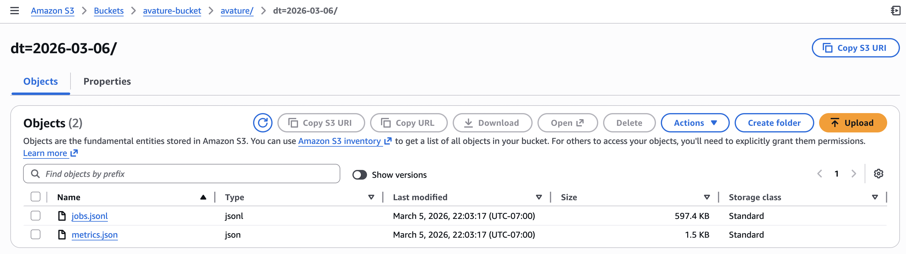
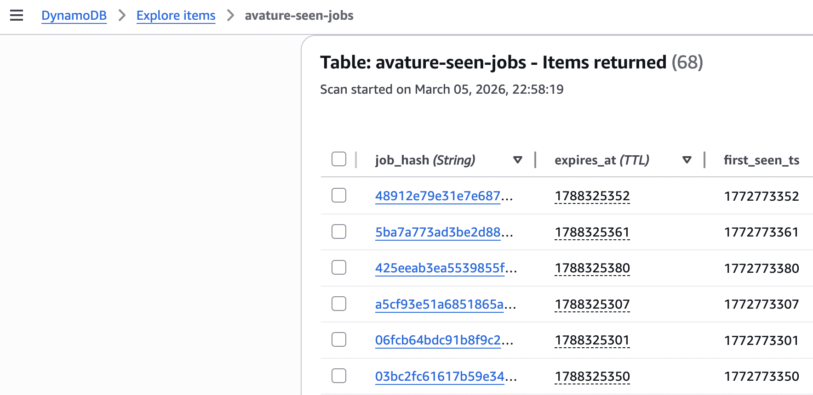
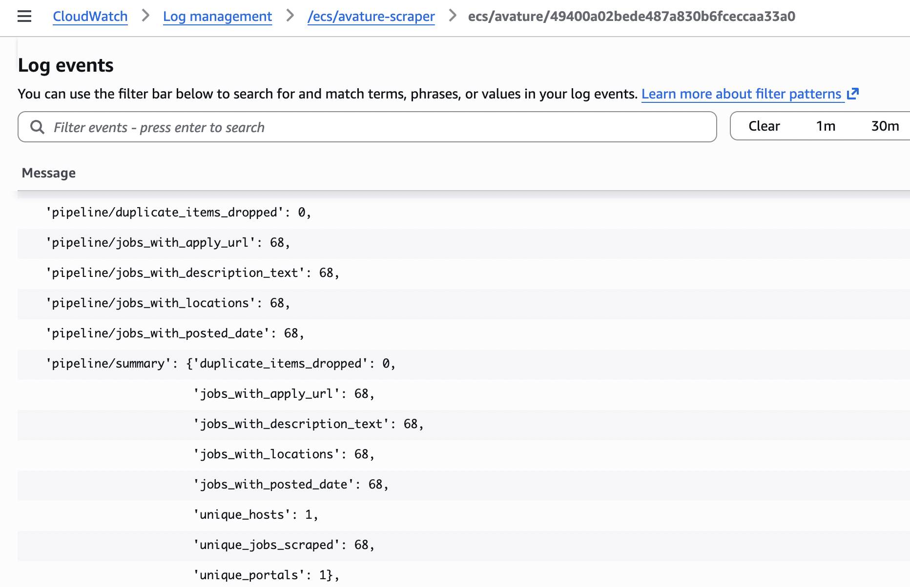

# Avature ATS ETL Pipeline

A pragmatic Scrapy project that crawls **Avature career portals** (job listings → job details), exports job listings. Designed to run:

- **Locally** (writes into `output/run_<RUN_ID>/...`)
- **On AWS** (streams output to **S3** via ECS (Fargate), logs to **CloudWatch**, cross-run dedupe via **DynamoDB**)

---

## What it scrapes

From each job detail page, the spider extracts (when available):

- **Job Title**
- **Job Description** (clean text; derived from Avature sections)
- **Application URL**
- Metadata:
  - `locations` (list)
  - `posted_date`
  - `company`
  - `career_area`
  - `employment_type`
  - `remote`
  - `ref_number`
  - `source_url`
  - `job_id`
  - **`job_hash`** (stable unique key)

---

## Outputs

### Local
Creates a unique run directory:

```
output/run_<RUN_ID>/
  jobs.jsonl
  metrics.json
  scrapy.log
```

### AWS
Writes to S3 (prefix uses date by default):

```
s3://<S3_OUTPUT_BUCKET>/avature/dt=<YYYY-MM-DD>/
  jobs.jsonl
  metrics.json
```

---

## Metrics

Primary metric:
- **Coverage** = count of **unique jobs** scraped (measured by `job_hash`)

Other metrics include:
- duplicates dropped (local run dedupe or AWS DynamoDB dedupe)
- completeness counters (jobs with description/locations/posted_date/apply_url)
- response status counts (200/404/429/5xx)
- request/response totals, exceptions, runtime

`metrics.json` is a **combined** stats snapshot that includes Scrapy stats and pipeline summary.

---

## Architecture


---

## Project structure

```
.
├── scrapy.cfg
├── input_urls.csv
├── requirements.txt
├── pyproject.toml
├── Dockerfile
├── core/
│   ├── items.py
│   ├── settings.py
│   ├── pipelines.py
│   ├── extensions.py
│   └── spiders/
│       └── avature_spider.py
└── output/
    └── run_<RUN_ID>/...
```

---

## Quickstart (local)

We use `uv` for fast local development, while maintaining `requirements.txt` for standard AWS Docker deployments.

### 1) Install

```bash
uv venv
source .venv/bin/activate
uv pip install -r requirements.txt
```

or don't use `uv`

```bash
python -m venv .venv
source .venv/bin/activate
pip install -r requirements.txt
```

### 2) Configure env

Copy environment example file by running the following:

```bash
cp .env.example .env # The file must be at your repository's root!
```

Create `.env` (example):
```env
DEPLOY_ENV=local
LOG_LEVEL=INFO
SCRAPY_FEED_NAME=jobs.jsonl
METRICS_FILE=metrics.json
METRICS_DUMP_INTERVAL=30
```

### 3) Run the spider
```bash
scrapy crawl avature
```

### 4) Check outputs
```bash
ls -la output/
ls -la output/run_*/   # latest run directory
```

---

## Running on AWS (ECS Fargate)

### Required AWS resources
- ECR repository (container image)
- ECS cluster and Fargate task definition
- CloudWatch log group
- S3 bucket for outputs
- 
- DynamoDB table for cross-run dedupe
- EventBridge Scheduler (daily trigger)


### Docker image architecture note (important)
If you build on Apple Silicon, ensure ECS uses the correct architecture:
- Build **multi-arch** (`linux/amd64,linux/arm64`) **OR**
- Set ECS task `runtimePlatform.cpuArchitecture=ARM64`


### DynamoDB dedupe (idempotency across runs)

**Why**: Scrapy’s in-memory/JobDir dedupe only prevents duplicates *within a run*. DynamoDB provides **cross-run idempotency**.

**How it works**:
- Pipeline attempts `PutItem` with `ConditionExpression attribute_not_exists(job_hash)`
- If condition fails, the job is considered already seen → dropped

Recommended table schema:
- Partition key: `job_hash` (String)
- Optional attributes:
  - `first_seen_ts` (Number)
  - `expires_at` (TTL Number) — to auto-expire old hashes


### Screenshots (Sample Run on AWS)

**1. S3 Data Lake Output**

<details>
<summary> Shows Hive-partitioned outputs generated by the ECS task </summary>



</details>

**2. DynamoDB Cross-Run Deduplication**
<details>
<summary> Shows stored `job_hash` keys preventing future duplicates </summary>



</details>

**3. CloudWatch Logs & Metrics**

<details>
<summary> Shows structured logs and emitted metrics from the ECS task </summary>



</details>

---